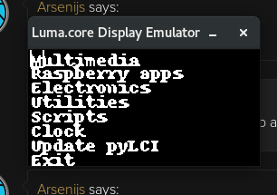

.. _setup:

Installing and updating ZPUI
############################

Installing ZPUI on a ZeroPhone
==============================

ZPUI is installed by default on official ZeroPhone SD card images. However, if 
for some reason you don't have it installed on your ZeroPhone's SD card, or if you'd like to 
install ZPUI on some other OS, this is what you have to do:

Installation
------------

.. code-block:: bash

    git clone https://github.com/ZeroPhone/ZPUI
    cd ZPUI/
    #Install main dependencies and create a system-wide ZPUI copy
    sudo ./setup.sh 
    #Start the system to test your configuration - do screen and buttons work OK?
    sudo python main.py 
    #Once tested:
    sudo ./update.sh #Transfer the working system to your system-wide ZPUI copy

.. admonition:: Behind the scenes
   :class: note

   There are two ZPUI copies on your system - your local copy, which you downloaded ZPUI into, 
   and a system-wide copy, which is where ZPUI is launched from when it's started
   as a service (typically, ``/opt/zpui``).
   When you run ``./setup.sh``, the system-wide (``/opt/zpui``) ZPUI copy is created,
   and a ``systemd`` unit file registered to run ZPUI from ``/opt/zpui`` at boot. 
   The system-wide copy can then be updated from the local copy using the ``./update.sh`` script.
   If you plan on modifying your ZPUI install, it's suggested you stick to a workflow like this:

   * Make your changes in the local copy
   * Stop the ZPUI service (to prevent it from grabbing the input&output devices), using ``sudo systemctl stop zpui.service``.
   * Test your changes in the local directory, using ``sudo python main.py``
   * If your changes work, transfer them to the system-wide directory using ``sudo ./update.sh``

   Such a workflow is suggested to allow experimentation while making it harder 
   to lock you out of the system, given that ZPUI is the primary interface for ZeroPhone
   and if it's inaccessible, it might prevent you from knowing its IP address, 
   connecting it to a wireless network or turning on SSH.
   In documentation, ``/opt/zpui`` will be referred to as **system-wide copy**, 
   while the directory you cloned the repository into will be referred to 
   as **local copy**.

Updating
--------

To get new ZPUI changes from GitHub, you can run **"Settings"** -> **"Update ZPUI"** 
from the main ZPUI menu, which will update the system-wide copy by doing ``git pull``.

If you want to sync your local copy to the system-wide copy, you can run ``update.sh``
It **1)** automatically pulls new commits from GitHub and **2)** copies all the 
changes from local directory to the system-wide directory. 

.. tip:: To avoid pulling the new commits from GitHub when running ``./update.sh``, 
          just comment the corresponding line out from the ``update.sh`` script. 

Systemctl commands
------------------

To control the system-wide ZPUI copy, you can use the following commands:

* ``systemctl start zpui.service``
* ``systemctl stop zpui.service``
* ``systemctl status zpui.service``

Launching the system manually
-----------------------------

For testing configuration or development, you will want to launch ZPUI directly 
so that you will see the logs and will be able to stop it with a simple Ctrl^C. 
In that case, just run ZPUI with ``sudo python main.py`` from your local (or system-wide) directory. 

-----------

.. _emulator:

Installing the ZPUI emulator
============================

If you want to develop ZPUI apps, but don't yet have the ZeroPhone hardware, 
there's an option to use the emulator with a Linux PC - the emulator can use your 
screen and keyboard instead of ZeroPhone hardware. The emulator works very well for 
app development, as well as for UI element and ZPUI core feature development.

System requirements
-------------------

* Some kind of Linux - there are install instructions for Ubuntu, Debian and OpenSUSE, but it will likely work with other systems, too
* Graphical environment (the emulator is based on Pygame)
* A keyboard (the same keyboard that you're using for the system will work great)

Ubuntu/Debian installation
--------------------------

Assuming Python 2 is the default Python version:

.. code-block:: bash

    sudo apt-get update
    sudo apt-get install python-pip git python-dev build-essential python-pygame
    sudo pip install luma.emulator
    git clone https://github.com/ZeroPhone/ZPUI
    cd ZPUI
    ./setup_emulator
    #Run the emulator
    python main.py

Arch Linux installation
-----------------------
.. code-block:: bash

    sudo pacman -Si python2-pip git python2-pygame
    sudo pip2 install luma.emulator

    git clone https://github.com/ZeroPhone/ZPUI
    cd ZPUI
    ./setup_emulator
    #Run the emulator
    python2 main.py

OpenSUSE installation
---------------------

.. code-block:: bash

    sudo zypper install python2-pip git python2-devel gcc python2-curses python2-pygame #If python2- version is not available, try python- and report on IRC - can't test it now
    sudo pip2 install luma.emulator
    git clone https://github.com/ZeroPhone/ZPUI
    cd ZPUI
    ./setup_emulator
    #Run the emulator
    python2 main.py

Emulator credits
----------------

Most of the emulator research and work was done by Doug, and later 
refactored by Brian Dunlay. The input driver was done by Arsenijs. 
OpenSUSE instructions were compiled with help of `piajesse`_.
Arch Linux instructions were compiled by `monsieurh`_.

.. _monsieurh: https://github.com/monsieurh
.. _piajesse: https://hackaday.io/piajesse
