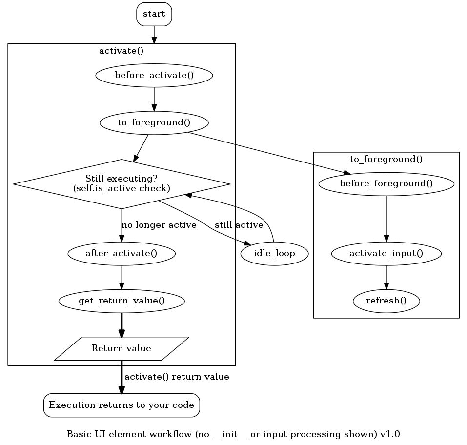

.. _ui_internals:

####################
UI element internals
####################

What happens when you call, say, ``menu.activate()``?

In other words, ``activate()`` blocks execution of your code until the user exits the UI element
(or it exits through other means, say, by calling ``deactivate()`` from another thread).

When writing child UI elements based on ``BaseUIElement``:

  * There are hooks that you can use to execute things at various stages of UI element's
    ``activate()`` - namely, ``before_foreground()``, ``before_activate()`` and
    ``after_activate()``

    * When overriding, don't forget to execute the original hook, too - we might put
      stuff there in the future, and there will definitely be useful code there if you
      inherit from a child UI element - i.e ``Menu`` uses ``before_foreground()`` 
      for "contents hook" functionality (dynamic fetching of ``contents``).
    * The difference between ``before_activate()`` and ``before_foreground()`` is
      that ``before_activate()`` will only be called once - during ``activate()``.
      ``to_foreground()``, however, can be called multiple times - once during
      ``activate()``, but also every time when the UI element goes back to foreground
      (i.e. parent menu going back to foreground after a child menu finished executing).
      Consequently, ``before_foreground`` will be called each time ``to_foreground``
      is called, that is, one or more times.

  * You can also override functions like ``idle_loop`` (used in ``Refresher`` and tests),
    in that case, make sure to call the original function too (and read its code to check
    for side effects).

How does the input processing work?

Notes:

  * Simple example - all the  move_up/move_down calls in i.e. a Menu are actually
    executed from a different thread - not the one where ``activate()`` runs, but
    a thread that was launched by ``activate()``.
  * The input thread will only check the exit flag between callback invocations. So,
    when you signal the input thread to exit (by using stop_listen), it will not
    exit while it's still in the middle of processing a callback - only after it's
    finished processing it.
